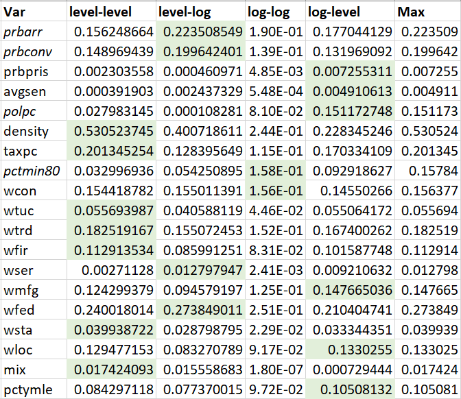

```{r setup, include=FALSE}
knitr::opts_chunk$set(echo = TRUE)
```

\tableofcontents 
<!--
\listoffigures
\listoftables
-->
\newpage

# Introduction (Stage 1: Draft Report)

The team has been hired to provide research for a political campaign and help the campaign understand the
determinants of crime and to help with policy suggestions that are applicable to local government.  

```{r}
library(knitr)
library(kableExtra)

codebook <- read.csv('codebook.csv')
crime <- read.csv('crime_v2.csv')

# Convert columns to factors and logical.
crime$county <- as.factor(crime$county)
crime$year <- as.factor(crime$year)
crime$west <- as.logical(crime$west)
crime$central <- as.logical(crime$central)
crime$urban <- as.logical(crime$urban)

# Create a log of the dependent variable
crime$logcrmrte <- log(crime$crmrte)
crime$east <- !(crime$west | crime$central)

# Create an average of all weekly wages values. 
crime$avgwage = (crime$wcon + crime$wtuc + crime$wtrd + crime$wfir + 
                   crime$wser + crime$wmfg + crime$wfed + crime$wsta + crime$wloc)/9

# Possible transformation for prbconv
#crime$adjprbconv = crime$prbconv/max(crime$prbconv)

# Reorder to place logcrmte next to crmrte and east next to central
# It's unsafe to keep this in, but handy for viewing data
#crime <- crime[,c(1,2,3,26,4:13,27,14:25,28)]

```

# Exploratory Data Analysis

##  Data Summary

We were provided with a dataset of crime statistics for a selection of counties in North Carolina. After performing data clean up (outlined below) the data set contained 90 county observations each having 25 variables (onlined in the codebook found in Appendix A).

<!--
From the assignment to incorporate above:
The data on convictions is
taken from the prison and probation files of the North Carolina Department of Correction.

The percent young male variable records the proportion of the population that is male and between the ages
of 15 and 24. This variable, as well as percent minority, was drawn from census data.

The number of police per capita was computed from the FBI’s police agency employee counts.

The variables for wages in different sectors were provided by the North Carolina Employment Security
Commission.
-->

### Data Clean Up

#### Null Rows
The dataset contained a an apostrophe 6 rows after the data which caused the csv reader to create 6 invalid rows.  We feel it is safe to remove these rows as they contain no data. 
```{r}
# Delete the 6 empty observations at the end, including the row with the apostrophe.
# We can use complete.cases to do this as these 6 observations are the only incomplete observations. 
crime = crime[complete.cases(crime), ]

# Fix prbconv which is a factor rather than numeric due to the apostrophe
# Convert from factor to numeric 
crime$prbconv = as.numeric(as.character(crime$prbconv))

```

We found two identical observations for county 193.  There is no logical reason to have two identical observations in this cross-sectional data, so we feel strongly that removing one of these two observations can only benefit our analysis. 
```{r}
# county 193 is duplidated, remove one
crime = crime[!duplicated(crime), ]

```


### Concerns about data

There are three probability columns in the given dataset. Check if any of the columns has invalid values - i.e., any of the columns have less than zero or greater than 1 values.

```{r}
#any(crime$prbarr<0 | crime$prbarr>1)
#any(crime$prbconv<0 | crime$prbconv>1)
#any(crime$prbpris<0 | crime$prbpris>1)

#summary(crime$prbarr)
#summary(crime$prbconv)


summary(crime$prbarr)[c(1,6)]
summary(crime$prbconv)[c(1,6)]
summary(crime$prbpris)[c(1,6)]

nrow(crime[(crime$prbarr<0 | crime$prbarr>1), c('county', 'prbarr')])
nrow(crime[(crime$prbconv<0 | crime$prbconv>1), c('county', 'prbconv')])


```

#### prbarr (Probability of Arrest)
We found that county 115 contained a value of 1.09 in prbarr (probability of arrest) which is not possible.  We beleive this to be a coding error, it is a ratio and not a probability.

#### prbconv (Probability of Conviction)
We found 10 observations with values greater than 1, which, again, is not a possible value for probability.  The documentation in the codebook specifies that "(t)he probability of conviction is proxied by the ratio of convictions to arrests", which leaves some ambiguity, however it is plausible to have values greater than 1 as a single arrest can result in multiple convictions.


## Univariate Analysis

```{r}
quick_uni_analysis = function(variable, description, roundto = 8) {
  hist(variable, xlab = paste(tools::toTitleCase(description),
                              paste('\n Shapiro p-value:',
                  round(as.numeric(shapiro.test(variable)[2]), roundto)
                  )), 
         main = ""
     )
  
  hist(log(crime$crmrte), 
       xlab = tools::toTitleCase(paste('Log of', description,
                                       paste('\n Shapiro p-value:',
                    round(as.numeric(shapiro.test(log(variable))[2]), roundto)
                    ))), 
           main = ""
       )
  var_shpr <- shapiro.test(variable)[2]
  var_log_shpr <- shapiro.test(log(variable))[2]
  table_out <- data.frame(shptst = var_shpr, shplogtst = var_log_shpr)
  colnames(table_out) <- c('Shapiro test', 'Shapiro test log')

  kable(table_out)
  #kable(table_out, "latex", longtable = TRUE, booktabs = TRUE, caption = "") %>%
  #kable_styling(full_width = TRUE, latex_options = c("HOLD_position", "striped", "repeat_header"), row_label_position = 1)  


    
}
```

### Log Transforms
(just a screen cap for now)



### Key Interests

#### Crimes Committed Per Person
**Campaign Significance**: Crime rate is a politicized and effects economy  

This is the key variable we will be regressing to in our modeling. 

```{r, fig.height=2.5, fig.width=3, fig.show='hold'}
quick_uni_analysis(crime$crmrte, 'crimes committed per per.')
```

Crimes committed per capita has a positive skew, applying a natural log transformation creates a more symmetrical distribution and results in a Shapiro-Wilk test p-value that we cannot reject.  

The transformed variable is preferable for modelling. 

#### Offence Mix (this leads to a model with mix as the dependent var, we can move this section down)
<!-- TODO -->
This is a ratio of face-to-face crimes to all other crimes.  Face-to-face crimes include violent crimes and those with a higher probability of violence, hense the more severe crimes.  Focusing resources which reduces this ratio along with the overall crime rate would be more beneficial.   

**Campaign Significance**: Violent crimes create fear and fear is a strong motivator for voters.

```{r, fig.height=2.5, fig.width=3, fig.show='hold'}
quick_uni_analysis(crime$mix, 'face-to-face crimes to others')
```

Mix of face-to-face crimes to other crimes has a positive skew, applying a natural log transformation creates a more symmetrical distribution however, the resultingShapiro-Wilk test would be rejected at 0.039.  That said, the log transformation is   

The transformed variable is preferable for modelling.

### Explanatory

#### Probability of Arrest
```{r, fig.height=3, fig.width=3, fig.show='hold'}
quick_uni_analysis(crime$prbarr, 'Probability of Arrest')
```

Probability of Arrest has a positive skew, applying a natural log transformation creates a more symmetrical distribution and results in a Shapiro-Wilk test p-value that we cannot reject.  

The transformed variable is preferable for modelling.

#### Probability of Conviction
```{r, fig.height=2.5, fig.width=3, fig.show='hold'}
quick_uni_analysis(crime$prbconv, 'Probability of Conviction')
```

Log is preferable - both for interpretation and for better adhering to modeling assumptions. However, even the logged version fails a Shapiro-Wilk normality test. Something to keep in mind.

#### Probability of Prison
```{r, fig.height=2.5, fig.width=3, fig.show='hold'}
quick_uni_analysis(crime$prbpris, 'Probability of Prison')
```

From an interpretation standpoint, the logged version is preferable, although from an modeling assumption standpoint, the unlogged version is preferable. 

#### Average Sentence
```{r, fig.height=2.5, fig.width=3, fig.show='hold'}
quick_uni_analysis(crime$avgsen, 'Average Sentence')
```

The logged version is preferable from both an interpretation and modeling assumption standpoint.

#### Police as a Percentage of Population
```{r, fig.height=2.5, fig.width=3, fig.show='hold'}
quick_uni_analysis(crime$polpc, 'Police as Per. of Pop.')

```

Both logged and un-logged versions of police as a percentage of the population are non-normal. Neither is inherently preferable from a modeling assumptions standpoint. 

The inclusion of this variable in a model needs to take in to consideration that an increase in crime can cause an increase in the number of police blah blah blah <!-- TODO -->.  Without timeseries data including changes to Police as a Percentage of Population we cannon determine the true effects.  However, many studies show that increasing the size of a police force does reduce crime.
<!-- 
http://www.princeton.edu/~smello/papers/cops.pdf 
https://www.jstor.org/stable/10.1086/666614 (VPN Needed Kevin has a copy)
-->

```{r, fig.height=2.5, fig.width=3, fig.show='hold'}
quick_uni_analysis(crime$pctymle, 'Per. of Pop. That Are Young Males')
```

Both logged and un-logged versions of the percent of population that is young and male are non-normal. Neither is inherently preferable from a modeling assumptions standpoint. 

```{r, fig.height=2.5, fig.width=3, fig.show='hold'}
quick_uni_analysis(crime$density, 'people per sq. mile')
plot(log(crime$density))
boxplot(log(crime$density))
plot(crime$logcrmrte)
boxplot(crime$logcrmrte)
```

```{r, fig.height=2.5, fig.width=3, fig.show='hold'}
quick_uni_analysis(crime$pctmin80, 'perc. minority, 1980')
```


\newpage

# Model Analysis

Using variables and transforms identified in the univariate analysis above we created the following models.

## General Crime Prediction Model
```{r}
#general_model = lm(crmrte ~ prbarr + prbconv + polpc + pctmin80, data = crime)
#general_model = lm(crmrte ~ log(prbarr) + log(prbconv) + polpc + log(pctmin80), data = crime)

#general_model = lm(logcrmrte ~ prbarr + prbconv + log(polpc) + log(pctmin80), data = crime)
general_model = lm(crmrte ~ log(prbarr) + prbpris + prbconv + log(avgsen), data = crime)
general_aic = AIC(general_model)
general_bic = BIC(general_model)
general_rsquared = summary(general_model)[8]
general_adjrsquared = summary(general_model)[9]

print(general_aic)
print(general_bic)
print(general_rsquared)
print(general_adjrsquared)

par(mfrow = c(2,2))
plot(general_model)

```

polpc and pctmin80 are control 

+ density plice tax mix
## Simple Crime Prediction Model
```{r}

#general_model = lm(crmrte ~ log(prbarr) + log(prbconv) + polpc + log(pctmin80), data = crime)
#general_model = lm(logcrmrte ~ prbarr + prbconv + log(polpc) + log(pctmin80), data = crime)
#general_model = lm(crmrte ~ prbarr + prbconv + polpc + pctmin80, data = crime)

general_model = lm(crmrte ~ log(prbarr) + log(prbconv), data = crime)
general_aic = AIC(general_model)
general_bic = BIC(general_model)
general_rsquared = summary(general_model)[8]
general_adjrsquared = summary(general_model)[9]

print(general_aic)
print(general_bic)
print(general_rsquared)
print(general_adjrsquared)


par(mfrow = c(2,2))
plot(general_model)

```

## Kitchen Sink Crime Prediction Model
```{r}
general_model = lm(logcrmrte ~ prbarr + prbconv + wtrd + wfir + wmfg + wfed + wloc +
                     mix + pctymle +
                     log(polpc) + log(pctmin80)
                   , data = crime)
general_aic = AIC(general_model)
general_bic = BIC(general_model)
general_rsquared = summary(general_model)[8]
general_adjrsquared = summary(general_model)[9]

print(general_aic)
print(general_bic)
print(general_rsquared)
print(general_adjrsquared)

par(mfrow = c(2,2))
plot(general_model)

```

## Effects of Number of Police on Crime Mix
```{r}
general_model = lm(mix ~ polpc + pctmin80 + log(100*density) + pctymle, data = crime)
general_aic = AIC(general_model)
general_bic = BIC(general_model)
general_rsquared = summary(general_model)[8]
general_adjrsquared = summary(general_model)[9]

print(general_aic)
print(general_bic)
print(general_rsquared)
print(general_adjrsquared)


par(mfrow = c(2,2))
plot(general_model)

summary(general_model)

```

#### Police in High Density
```{r}
general_model = lm(crmrte ~ polpc, data = crime)
general_aic = AIC(general_model)
general_bic = BIC(general_model)
general_rsquared = summary(general_model)[8]
general_adjrsquared = summary(general_model)[9]

print(general_aic)
print(general_bic)
print(general_rsquared)
print(general_adjrsquared)


par(mfrow = c(2,2))
plot(general_model)

summary(general_model)

```

```{r}
general_model = lm(crmrte ~ polpc, data = crime[crime$density >= quantile(crime$density, .90), ])
general_aic = AIC(general_model)
general_bic = BIC(general_model)
general_rsquared = summary(general_model)[8]
general_adjrsquared = summary(general_model)[9]

print(general_aic)
print(general_bic)
print(general_rsquared)
print(general_adjrsquared)


par(mfrow = c(2,2))
plot(general_model)

summary(general_model)

```

More police in higher density correlatest to higher crime rate.  Probably not worth keeping, but interesting.


\newpage
# Omitted Variables

In order to make valid policy recommendations, we need confidence that our estimated coefficients for policy-relevant variables are unbiased, statistically significant, and practically significant. Statistical software makes it quite easy to determine if there is a relationship between a given variable and the dependent variable that is statistically significantly different from zero - an area of analysis that we will expand upon in follow-ups to this piece. Practical significance of our estimates requires just one extra step to interpret the meaning of the estimate for each variable under consideration. Accounting for elements which could bias our estimates is more difficult and, to some degree, not a solvable problem.  

We only have observational data available. Moreover, we are not able to design or even infer experiments for our data generating process. As such, we are left to reason about counterfactuals, rather than conduct experiments to verify the implications of our model. Additionally, we have a flawed data collection process, which we also have no ability to correct for. Our desired population variables are by-in-large not included in the dataset we were provided. Some of these desired variables are practically or ethically unobservable. Others were operationalized in a flawed manner, with a negative impact on our ability to model relationships with a causal interpretation. We address some of these issues here.  

Our ideal model of the causes of the crime rate would be something like:

$$
\begin{aligned}
crime\_rate &= \beta_0 + \beta_1crty\_punish + \beta_2svrty\_punish + \beta_3wealth\_inequality\ + \\ &\beta_4educ + \beta_5social\_cohesion + \beta_6weapon\_availability + \beta_7real\_wage\ + \\ &\beta_{8}low\_skill\_unemployment\_rate +\beta_{9}age\_15\_to\_30\_proportion\_population\ + \\ &\beta_{10}gender_imbalance + ... + error
\end{aligned}
$$

Unfortunately, we are unable to observe virtually all of these concepts.  

Some concepts have been operationalized in our dataset. For example, certainty of punishment has been operationalized through three variables: 1) the percent of the population which are police, 2) the proportion of arrests to crimes, and 3) the proportion of convictions to arrest. This is among the most effective operationlizations in this dataset. Severity of punishment is also operationalized  through 1) the proportion of convictions that result in a prison sentence and 2) the average length of a prison sentence. Nominal wages are operationalized in the dataset with average wages for certain industry groupings. None of ealth inequality within a given observation, education, social cohesion, weapon availability, cost of living, or the low skill unemployment rate are operationalized within this dataset.  

Moreover, certain variables which are included in our dataset are likely correlated with many of our desired variables, but actually measure something distinct - introducing the possibility for model estimates based on those variables to be biased and thus misleading. For example, the pctmin80 variable measures the percent of a county that was minority in 1980 - 7 years prior to our other observations. Setting the time divergence aside and extrapolating from national trends in the U.S. in the 1980s, the percentage of a county which is minority is likely negatively correlated with education. It may also exhibit a parabolic relation with wealth inequality and social cohesion. If we were to include pctmin80 in our regression, we would expect the model estimate to be biased as we have not adjusted for the impacts of education, wealth inequality, or social cohesion. Examining the impact of education alone on the estimator for pctmin80 - as education was likely negatively correlated with pctmin80, and we expect educated to be negatively related to the crime rate, the model's estimate of the impact of the percent of a county which was minority in 1980 would be upwardly biased. In other words, the estimator for pctmin80 in the underspecified model would imply a much larger relationship between pctmin80 and crime rate than actually exists.  

Similarly, our dataset contains a variable density which is likely correlated with two of our desired but unobserved explanatory variables: social cohesion and wealth inequality. In practice, in the U.S. in the 1980s, we would expect social cohesion to be negatively correlated with density, while wealth inequality would be positively correlated with density. We expect the beta for social cohesion to crime rate to be negative, while the beta for wealth inequality to crime rate is expected to be positive. The impact of both of these omitted variables is that the model's estimate for density is likely upwardly biased. As with pctmin80, the model would again overestimate the impact of density on crime rate.  

Our ability to interpret the variable polpc in our dataset is also compromised by omitted variable bias. While we understand the idea that increased police presence should increase the certainty of punishment (more likely to be detected and more likely to be caught) ceteris paribus, in our current dataset, we do not have the ability to use polpc in this way. We are unable to observe the counterfactual of the same location with the same characteristics at the same point in time having more or less police. Rather, the variable in our dataset is the current level of police as a percent of the population. Given that we expect local governments to respond to increased crime by highering more police, our model is more likely to reflect that higher crime rate locations also have higher police concentrations. Given an alternate work environment where we could retrieve more data, we might think about attempting to compensate for this by locating police concentration and crime rate statistics for previous years, then using them to create variables for the percentage point change in police concentration, which we could use to explain a newly created variable for the percentage point change in crime rate for a given location. However, in their current single point in time forms, our model is likely to estimate the relationship between police percentage and crime rate as positive, thus providing a misleadign estimate for the relationship we would actually like to observe. 

Finally, our dataset contains several variables with nominal wages for certain industries. Including these in our model is likely to be somewhat misleading, producing biased estimators because these measures are not adjusted for cost of living. Said in other terms, each of the nominal wage indicators is likely positively correlated with our desired explanatory variable - real wages. Conceptually, we expect the relationship between real wages and crime rate to be negative, while the relationship between real wages and nominal wages is positive. As such our model's estimator for wages is likely to understate the impact of wages on crime rate. As such, these nominal wage variables are an imperfect proxy for the desired variable real wages

\newpage

# Conclusion

From the assignment "Since you are restricted
to ordinary least squares regression, omitted variables will be a major obstacle to your estimates. You should
aim for causal estimates, while clearly explaining how you think omitted variables may affect your conclusions."

## Crime rate
Can use crime rate as leverage against incumbent if it's high, or to defend as the incumbent if it's low.

### Something about unfeasibility and unreliability of kitchen-sink model
While adding police, increasing sentences, pay everybody more money, 

### How to reduce overall crime
From selected models

### How to reduce mix ratio (violent crimes)
More police reduces mix ratio 

\newpage
# Appendix A: Codebook

```{r echo = FALSE, results = 'asis'}
kable(codebook[, c(2,3,4)], "latex", longtable = TRUE, booktabs = TRUE, caption = "Crime Data Codebook") %>%
  kable_styling(full_width = TRUE, latex_options = c("HOLD_position", "striped", "repeat_header"), row_label_position = 1)  
```

